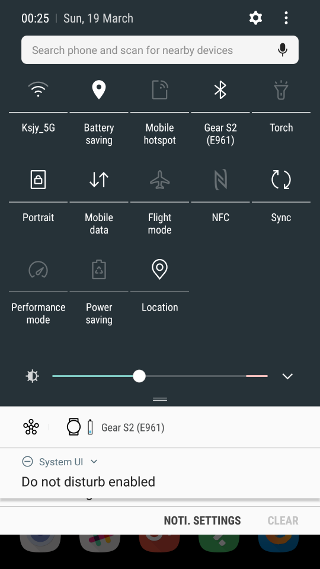
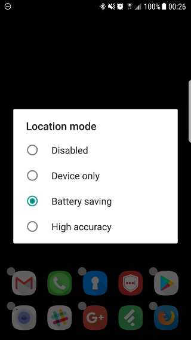

Location mode Tile
===================

**Location mode tile** is advanced version of standard Location Quick Settings tile which provides ability to select one of location provider modes to safe your battery:
* `Device only` - uses GPS to estimate your location
* `Battery saving` - uses WiFi and mobile networks to estimate your location (is suitable for most cases)
* `High accuracy` - uses GPS, WiFi and mobile networks to estimate your location

Some application requires any location to work, but if you turn location provider with standard tile, you will enable most battery hungry method (`High accuracy`). However `Battery saving` mode is suitable in most cases. It saves phone battery and still provided location to applications.

Problems
-----------------------------------
Standard applications have no ability to set location mode in runtime because of lack of permission to set secure settings. So this application won't work on Android devices without performing workaround.

Workaround
-----------------------------------
There is workaround to grant permission to application using developers mode on Android device connected to desktop.

Workaround steps:
1. Download and install ADB to desktop
2. Enable developers mode on Android Device
3. Connect device to desktop with USB
4. Run terminal command: `adb shell pm grant com.github.stevenrudenko.qst.location android.permission.WRITE_SECURE_SETTINGS`
5. Done!

Screenshots
-----------




-------------------------------------------------------------------------------

Developed By
============

* Steven Rudenko - <steven.rudenko@gmail.com>

License
=======
```
The MIT License (MIT)

Copyright (c) 2017 Steven Rudenko

Permission is hereby granted, free of charge, to any person obtaining a copy
of this software and associated documentation files (the "Software"), to deal
in the Software without restriction, including without limitation the rights
to use, copy, modify, merge, publish, distribute, sublicense, and/or sell
copies of the Software, and to permit persons to whom the Software is
furnished to do so, subject to the following conditions:

The above copyright notice and this permission notice shall be included in
all copies or substantial portions of the Software.

THE SOFTWARE IS PROVIDED "AS IS", WITHOUT WARRANTY OF ANY KIND, EXPRESS OR
IMPLIED, INCLUDING BUT NOT LIMITED TO THE WARRANTIES OF MERCHANTABILITY,
FITNESS FOR A PARTICULAR PURPOSE AND NONINFRINGEMENT. IN NO EVENT SHALL THE
AUTHORS OR COPYRIGHT HOLDERS BE LIABLE FOR ANY CLAIM, DAMAGES OR OTHER
LIABILITY, WHETHER IN AN ACTION OF CONTRACT, TORT OR OTHERWISE, ARISING FROM,
OUT OF OR IN CONNECTION WITH THE SOFTWARE OR THE USE OR OTHER DEALINGS IN
THE SOFTWARE.
```
